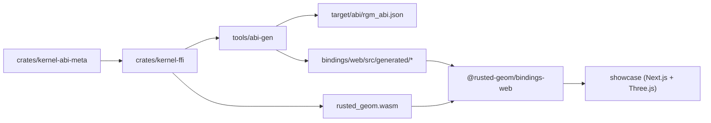

# rusted-geom

Metadata-driven geometry kernel binding pipeline in Rust.

## Project Status

`rusted-geom` is currently in alpha release stage (`0.1.0-alpha.1`).
APIs, generated artifacts, and package shape are expected to evolve quickly.

## Workspace Layout

- `crates/kernel-abi-meta`: ABI annotation proc macros.
- `crates/kernel-ffi`: session-scoped C ABI surface and geometry runtime.
- `tools/abi-gen`: metadata extractor and binding generator.
- `bindings/web`: generated TypeScript facade + typed WASM runtime bridge.
- `showcase`: Next.js full-page Three.js kernel viewer.

## Prerequisites

- Rust stable toolchain
- Rust target: `wasm32-unknown-unknown`
- Node.js and npm
- `pnpm` (the repo uses a pnpm workspace for local app workflows)

Install pnpm if needed:

```bash
npm install -g pnpm
```

## Quickstart (Local Run)

From a clean checkout, run these commands from repo root:

```bash
pnpm install
rustup target add wasm32-unknown-unknown
./scripts/generate_bindings.sh
./scripts/build_kernel_wasm.sh
pnpm --dir showcase dev
```

Open [http://localhost:3000](http://localhost:3000).

## Validate Local Setup

```bash
./scripts/check_bindings.sh
./scripts/check_abi_compat.sh
cargo test --workspace
npm --prefix ./bindings/web run typecheck
npm --prefix ./bindings/web run test
```

## Common Workflows

| Workflow | Command |
| --- | --- |
| Generate ABI + TS bindings | `./scripts/generate_bindings.sh` |
| Verify generated files are current | `./scripts/check_bindings.sh` |
| Enforce ABI compatibility against baseline | `./scripts/check_abi_compat.sh` |
| Update committed ABI baseline | `./scripts/update_abi_baseline.sh` |
| Build kernel wasm for showcase | `./scripts/build_kernel_wasm.sh` |
| Stage wasm into web bindings dist | `./scripts/stage_web_wasm.sh` |
| Build + pack `@rusted-geom/bindings-web` | `./scripts/pack_web.sh` |

## TypeScript Usage Examples

### 1. Runtime + session + curve evaluation

```ts
import {
  createKernelRuntime,
  type CurvePresetInput,
} from "@rusted-geom/bindings-web";
import wasmUrl from "@rusted-geom/bindings-web/wasm/rusted_geom.wasm";

const preset: CurvePresetInput = {
  degree: 2,
  closed: false,
  points: [
    { x: 0, y: 0, z: 0 },
    { x: 1, y: 0.25, z: 0 },
    { x: 2, y: 1.0, z: 0 },
    { x: 3, y: 1.25, z: 0 },
  ],
  tolerance: { abs_tol: 1e-9, rel_tol: 1e-9, angle_tol: 1e-9 },
};

const runtime = await createKernelRuntime(wasmUrl);
const session = runtime.createSession();

const curve = session.curve.buildCurveFromPreset(preset);
const point = session.curve.curvePointAt(curve, 0.35);
const length = session.curve.curveLength(curve);

console.log(point, length);

session.kernel.releaseObject(curve);
session.destroy();
runtime.destroy();
```

### 2. Mesh transform + boolean

```ts
const runtime = await createKernelRuntime(wasmUrl);
const session = runtime.createSession();

const host = session.mesh.createMeshBox({ x: 0, y: 0, z: 0 }, { x: 8, y: 8, z: 8 });
const tool = session.mesh.createMeshTorus({ x: 2, y: 0, z: 0 }, 2.5, 0.8, 64, 48);
const movedTool = session.mesh.meshTranslate(tool, { x: -0.4, y: 0.3, z: 0.2 });

// Boolean op: 2 = difference
const result = session.mesh.meshBoolean(host, movedTool, 2);
const triCount = session.mesh.meshTriangleCount(result);
console.log("Result triangles:", triCount);

session.kernel.releaseObject(result);
session.kernel.releaseObject(movedTool);
session.kernel.releaseObject(tool);
session.kernel.releaseObject(host);
session.destroy();
runtime.destroy();
```

### 3. Surface + face + intersection branch inspection

```ts
const runtime = await createKernelRuntime(wasmUrl);
const session = runtime.createSession();

const tol = { abs_tol: 1e-9, rel_tol: 1e-9, angle_tol: 1e-9 };

const surface = session.surface.createNurbsSurface(
  {
    degree_u: 1,
    degree_v: 1,
    periodic_u: false,
    periodic_v: false,
    control_u_count: 2,
    control_v_count: 2,
  },
  [
    { x: 0, y: 0, z: 0 },
    { x: 0, y: 1, z: 0 },
    { x: 1, y: 0, z: 0.1 },
    { x: 1, y: 1, z: 0.1 },
  ],
  [1, 1, 1, 1],
  [0, 0, 1, 1],
  [0, 0, 1, 1],
  tol,
);

const face = session.face.createFaceFromSurface(surface);
session.face.faceAddLoop(
  face,
  [
    { u: 0.05, v: 0.05 },
    { u: 0.95, v: 0.05 },
    { u: 0.95, v: 0.95 },
    { u: 0.05, v: 0.95 },
  ],
  true,
);
session.face.faceHeal(face);
console.log("Face valid:", session.face.faceValidate(face));

const inter = session.intersection.intersectSurfacePlane(surface, {
  origin: { x: 0.5, y: 0.5, z: 0.05 },
  x_axis: { x: 1, y: 0, z: 0 },
  y_axis: { x: 0, y: 1, z: 0 },
  z_axis: { x: 0, y: 0, z: 1 },
});

const branchCount = session.intersection.intersectionBranchCount(inter);
for (let i = 0; i < branchCount; i += 1) {
  const summary = session.intersection.intersectionBranchSummary(inter, i);
  const points = session.intersection.intersectionBranchPoints(inter, i);
  console.log(i, summary, points.length);
}

session.kernel.releaseObject(inter);
session.kernel.releaseObject(face);
session.kernel.releaseObject(surface);
session.destroy();
runtime.destroy();
```

## High-Level Architecture



## ABI Compatibility Rule

`./scripts/check_abi_compat.sh` requires zero breaking ABI changes versus the committed baseline unless you intentionally advance the version policy and refresh baseline artifacts.

If a breaking change is intentional, update baseline artifacts in the same change:

```bash
./scripts/update_abi_baseline.sh
```

## Algorithm Documents

Available algorithm docs in this repository:

- [NURBS Fit-Point Constructor RFC (M1)](docs/algorithms/nurbs-fit-point-interpolation-rfc.md)

## Additional Documentation

- [ABI Stability](docs/architecture/abi-stability.md)
- [Kernel Module Map](docs/architecture/kernel-module-map.md)
