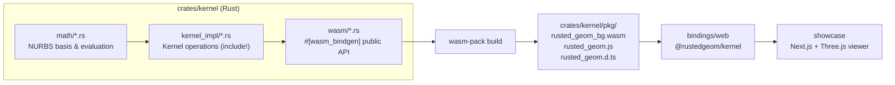

# Kernel Module Map

This document tracks the current split of the kernel FFI surface by domain and the high-level flow from Rust to web runtime consumers.

## High-Level Architecture

## wasm/ module split

| File | Responsibility |
|------|---------------|
| `wasm/mod.rs` | `KernelSession` struct, handle macros (`CurveHandle`, `SurfaceHandle`, …) |
| `wasm/curve.rs` | Curve constructors (line, circle, arc, polyline, polycurve, NURBS fit) and evaluation |
| `wasm/surface.rs` | NURBS surface construction, evaluation, tessellation |
| `wasm/mesh.rs` | Mesh construction, transforms, access, boolean operations |
| `wasm/face.rs` | Trimmed face creation, loop editing, validation, heal, tessellation |
| `wasm/brep.rs` | B-rep assembly, shell/solid lifecycle, validation, native I/O |
| `wasm/intersection.rs` | Curve/surface/mesh intersection, branch access, intersection curve evaluation |
| `wasm/bounds.rs` | Bounding box computation (AABB + OBB) |
| `wasm/error.rs` | `Result<T, JsValue>` helper (maps `RgmStatus` → JS `Error`) |

## kernel_impl/ C ABI layer

The `ffi_*.rs` files in `kernel_impl/` implement the `extern "C"` export layer used by
native Rust tests and as the internal implementation behind the wasm-bindgen API.
These are included via `include!` in `kernel_impl.rs`.

## CI

- `.github/workflows/ci.yml`
  - Rust: `cargo test -p kernel`
  - WASM: `wasm-pack build --target web --release`
  - TypeScript: `npm run typecheck` in `bindings/web`
  - Web runtime: `npm run test` in `bindings/web`
  - E2E: `npx playwright test` in `showcase`
