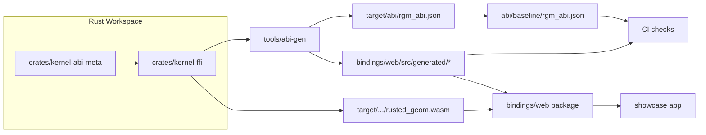

# Kernel Module Map

This document tracks the current split of the kernel FFI surface by domain and the high-level flow from Rust ABI to web runtime consumers.

## High-Level Architecture

## FFI export files

- `crates/kernel-ffi/src/ffi/exports/kernel.rs`
  - kernel lifecycle, object release, last-error access
- `crates/kernel-ffi/src/ffi/exports/memory.rs`
  - allocator/deallocator exports
- `crates/kernel-ffi/src/ffi/exports/curve.rs`
  - curve constructors and interpolation exports
- `crates/kernel-ffi/src/ffi/exports/mesh.rs`
  - mesh constructors, transforms, access, boolean, mesh intersections
- `crates/kernel-ffi/src/ffi/exports/surface.rs`
  - NURBS surface construction/evaluation/tessellation exports
- `crates/kernel-ffi/src/ffi/exports/face.rs`
  - trim/face editing, validation/heal, tessellation exports
- `crates/kernel-ffi/src/ffi/exports/intersection.rs`
  - curve evaluation exports and intersection object/branch exports

## Runtime session files

- `bindings/web/src/runtime/session/core.ts`
  - low-level bridge to native exports and memory operations
- `bindings/web/src/runtime/session/index.ts`
  - public runtime/session facade
- `bindings/web/src/runtime/session/kernel.ts`
- `bindings/web/src/runtime/session/curve.ts`
- `bindings/web/src/runtime/session/mesh.ts`
- `bindings/web/src/runtime/session/surface.ts`
- `bindings/web/src/runtime/session/face.ts`
- `bindings/web/src/runtime/session/intersection.ts`

## CI/guardrails

- `scripts/check_modularity.sh`
  - protects entry-facade file growth
- `scripts/check_bindings.sh`
  - verifies generated outputs are up to date
- `scripts/check_abi_compat.sh`
  - enforces ABI compatibility against baseline with semver policy
- `.github/workflows/ci.yml`
  - runs Rust, binding, ABI, and web runtime checks
